[English](README.md) | [简体中文](README.zh-CN.md)

# MoviCloud Media Cloud (Docker-first Guide)

MoviCloud is a Nuxt 3-based media hub that aggregates TMDB data for movies and TV. This guide focuses on how to use the app, especially installing and running with Docker.

## Highlights

- Movies/TV details, cast, recommendations
- Smooth UX with image lazy loading and caching
- Dark theme and responsive layout
- First-run installation wizard
- Official Docker image: `movicloud/movicloud-app` (amd64/arm64)

---

## 1. Quick Start (Docker)

### 1) Pull the image
```bash
docker pull movicloud/movicloud-app:latest
```

### 2) Run (simple)
```bash
docker run -d \
  --name movicloud \
  -p 15078:15078 \
  -v movi_data:/movicloud-app/data \
  -e NODE_ENV=production \
  movicloud/movicloud-app:latest
```
- URL: `http://<your-host>:15078`
- The first visit will redirect to the installation wizard (`/install`)
- Data (DB, uploads) are persisted at `/movicloud-app/data`

### 3) Recommended: Docker Compose
```yaml
services:
  movicloud:
    image: movicloud/movicloud-app:latest
    container_name: movicloud
    restart: unless-stopped
    ports:
      - "15078:15078"
    environment:
      - NODE_ENV=production
      # Optional: timezone & JWT secret
      - TZ=Asia/Shanghai
      - JWT_SECRET=your-strong-secret
      # Optional: proxy in restricted networks (only if needed)
      # - HTTP_PROXY=http://host.docker.internal:7890
      # - HTTPS_PROXY=http://host.docker.internal:7890
      # - NO_PROXY=localhost,127.0.0.1
    volumes:
      - movi_data:/movicloud-app/data
volumes:
  movi_data:
```
Start:
```bash
docker compose up -d
```

---

## 2. First-time Installation Wizard

1. Visit `http://<your-host>:15078/install`
2. Configure in the wizard:
   - TMDB API Key
   - Language and Theme
   - Network proxy (if needed)
   - Admin account creation
3. You can change all settings later on the Settings page.

Note: frequently used settings are cached on the client; caches refresh after changes.

---

## 3. Persistence and Paths

- App data: `/movicloud-app/data`
  - Database: `/movicloud-app/data/movicloud.db`
  - Avatars: `/movicloud-app/data/uploads/avatars`
- Logs: `/movicloud-app/logs` (optional mount)
- In production, uploaded files are served under: `/uploads/avatars/<filename>`
  - Example: `http://<your-domain>/uploads/avatars/avatar_1690000000000.png`

Use either named volumes or bind mounts, e.g.:
```bash
docker run -d \
  --name movicloud \
  -p 15078:15078 \
  -v /your/host/path/data:/movicloud-app/data \
  movicloud/movicloud-app:latest
```

> If using a host directory, ensure it is writable by the container user (default `node`).

---

## 4. Upgrade & Rollback

- Upgrade to latest:
```bash
docker pull movicloud/movicloud-app:latest
# If using `docker run`: stop and remove the old container, then start again with the same volume mappings
```
- Docker Compose:
```bash
docker compose pull
docker compose up -d
```
- Roll back to a specific version:
```bash
docker run -d ... movicloud/movicloud-app:1.0.1
```

Image tags: `latest` and semantic versions like `1.0.1`, `1.0`.

---

## 5. FAQ

- Q: Cannot access the app?
  - Check port mapping `-p 15078:15078`
  - If behind a reverse proxy, ensure it forwards to container port `15078`

- Q: Avatars not persisted or 404 in Docker?
  - Ensure the `data` volume is mounted: `/movicloud-app/data`
  - Access path should look like `/uploads/avatars/<filename>`
  - If using a host directory, ensure write permission (named volume recommended)

- Q: Slow image/TMDB access in restricted networks?
  - Configure proxy in the wizard or Settings; or set `HTTP_PROXY/HTTPS_PROXY` in env
  - TMDB image base URL is cached; caches refresh after changes

- Q: Health check?
  - Endpoint: `/api/health` (200 OK means healthy)

- Q: Security & timezone?
  - Set `JWT_SECRET` and `TZ`

---

## 6. Reverse Proxy (optional)

Nginx example:
```nginx
server {
  listen 80;
  server_name your.domain.com;

  location / {
    proxy_pass http://127.0.0.1:15078;
    proxy_set_header Host $host;
    proxy_set_header X-Real-IP $remote_addr;
    proxy_set_header X-Forwarded-For $proxy_add_x_forwarded_for;
    proxy_set_header X-Forwarded-Proto $scheme;
  }

  # Optional: uploads (app already serves /uploads/)
  location /uploads/ {
    proxy_pass http://127.0.0.1:15078;
  }
}
```

---

## 7. Screenshots

- Installation Welcome:

  

- TMDB Settings (Install):

  

- User Setup (Install):

  

- Install Confirmation:

  

- Installation Success:

  

- User Login:

  

- Home Carousel & Recommendations:
  
  

- Movie Library:

  

- Movie Details:

  

- Movie Download Dialog:

  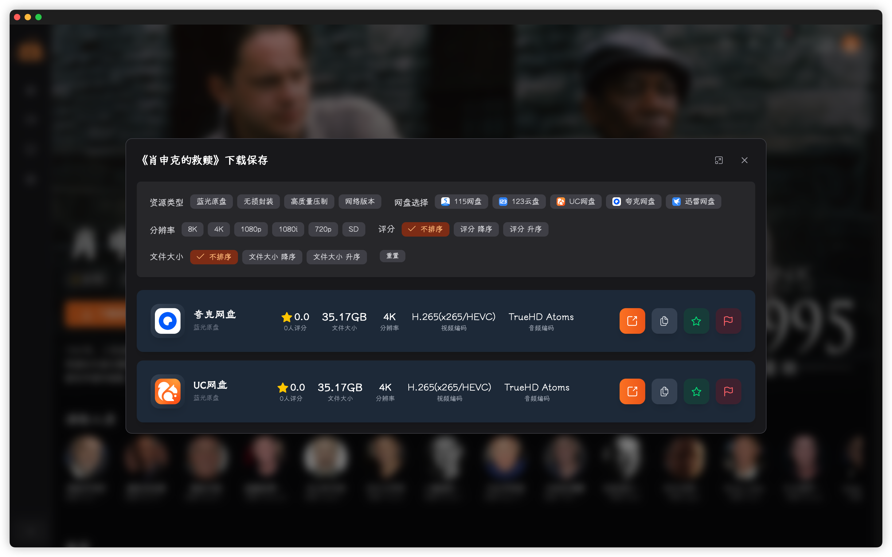

- Movie Share Dialog:

  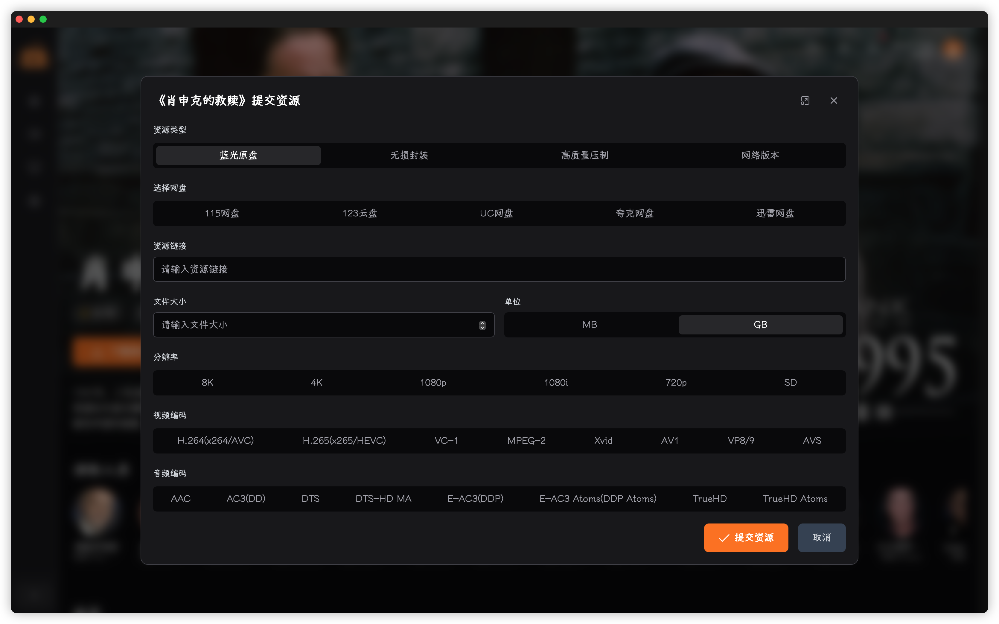

- TV Library:

  

- TV Details:

  

- TV Download Dialog:

  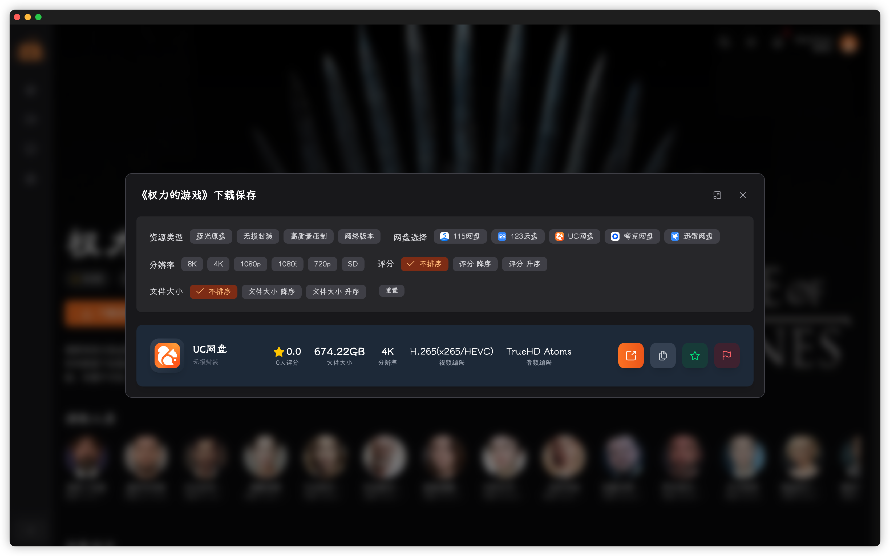

- TV Share Dialog:

  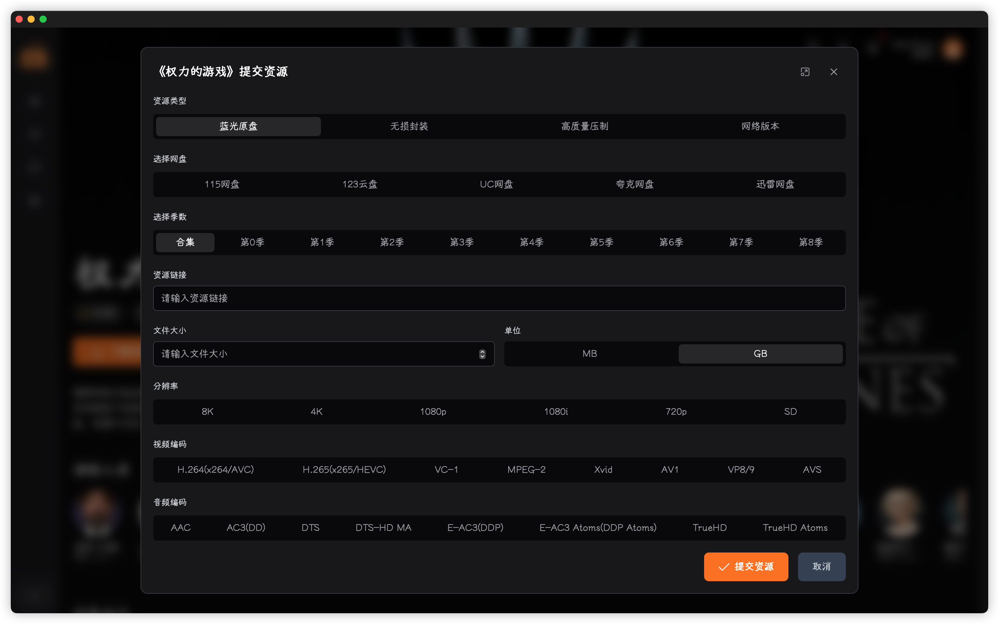

- TV Season Details Dialog:

  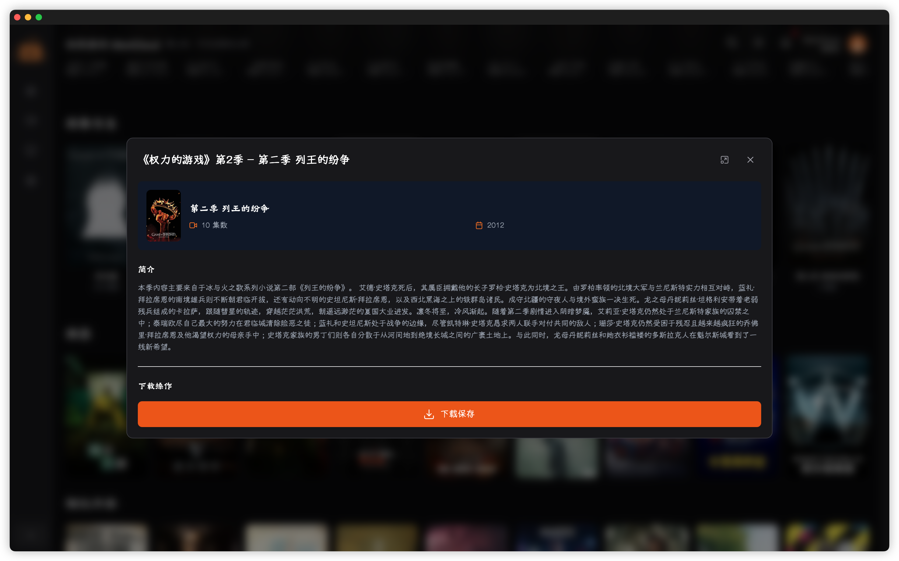

- Person Details:
  
  

- Search Dialog:
  
  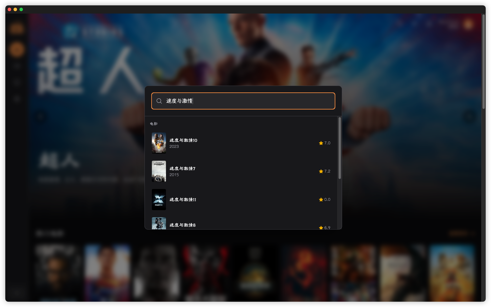

- Theme & Fonts Settings:
  
  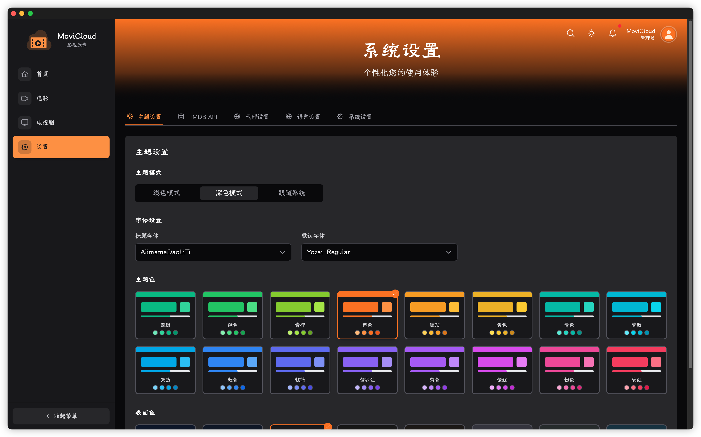

- TMDB Settings (Settings Page):
  
  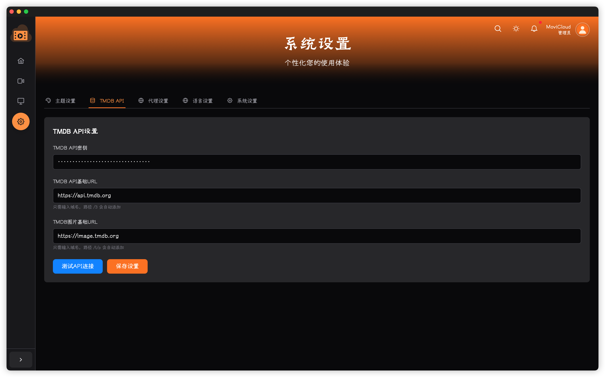

- System Proxy Settings:
  
  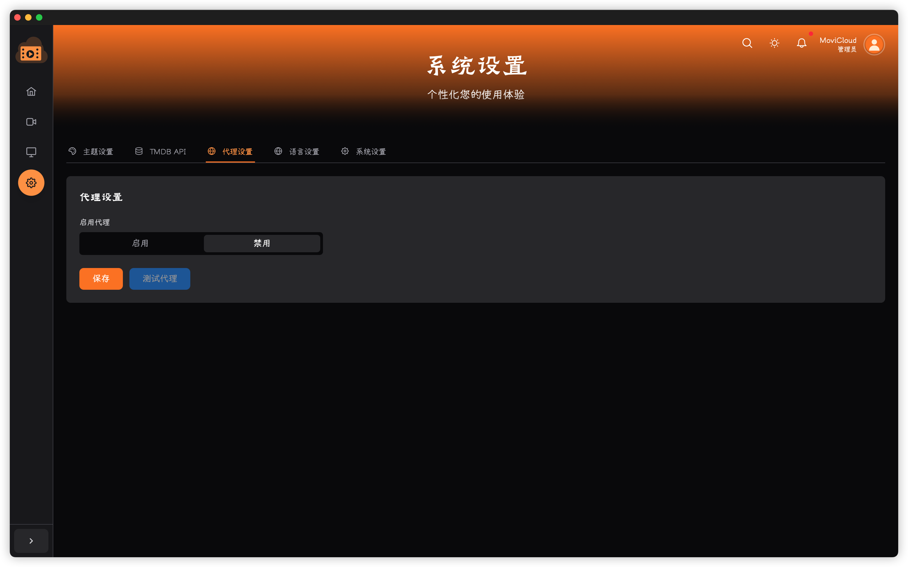

- Language Settings:
  
  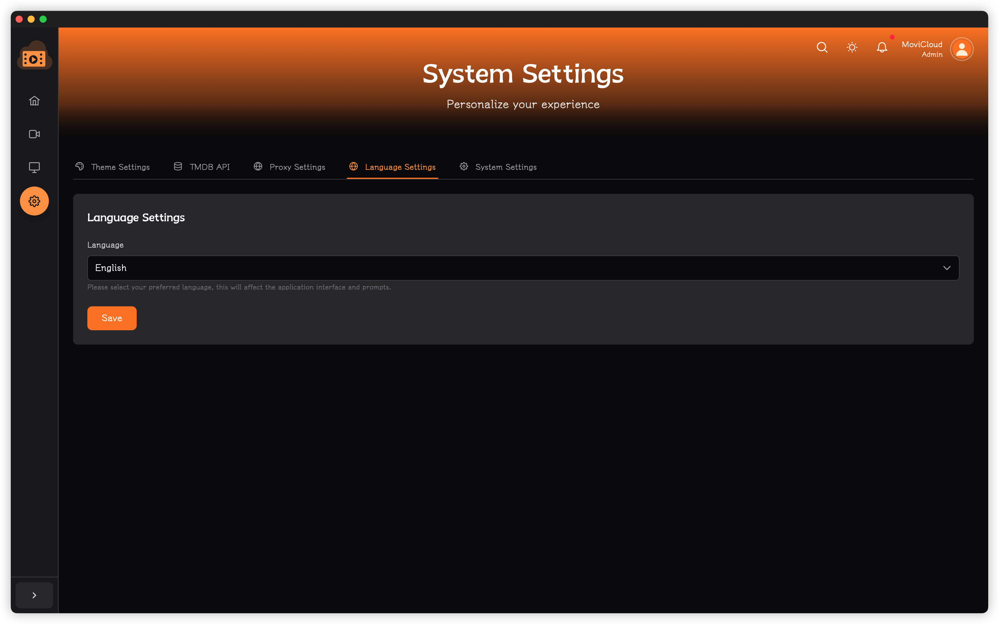

- Profile:
  
  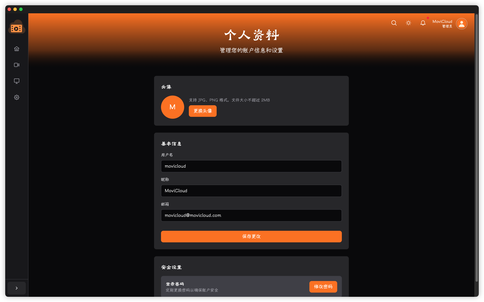