[English](README.md) | [简体中文](README.zh-CN.md)

# MoviCloud Media Hub

MoviCloud is a Nuxt 3-based media hub that aggregates TMDB data for movies and TV shows, featuring details display, search, user profiles, and download integration.

## Highlights

- 🎬 Movies/TV details, cast, recommendations
- ⚡ Smooth UX with image lazy loading and caching
- 🌙 Dark theme and responsive layout
- 🧭 Installation wizard for easy setup
- 📦 Supports fnOS, Synology, and Docker installation

---

## I. Installation Guide

We recommend installing MoviCloud on your NAS device for the best experience.

### 1. fnOS Installation (Recommended)

You can install MoviCloud on fnOS using one of the following methods:

*   **App Store**: Open the fnOS App Store, search for "MoviCloud", and install it directly.
*   **Manual Installation**: Download the latest `.fpk` package from the [GitHub Releases](https://github.com/MoviCloud-com/movicloud-app/releases) page and manually upload it to your fnOS system.

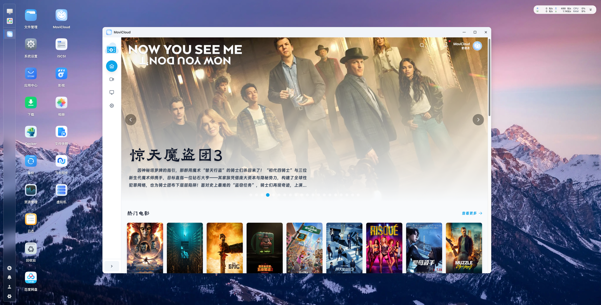

### 2. Synology Installation (Recommended)

Download the latest `.spk` package from the [GitHub Releases](https://github.com/MoviCloud-com/movicloud-app/releases) page and manually upload it to the Synology Package Center.

### 3. Docker Installation

If you are familiar with Docker, you can use the following command to start quickly:

```bash
docker run -d \
  --name movicloud \
  -p 15078:15078 \
  -v movi_data:/movicloud-app/data \
  -e NODE_ENV=production \
  movicloud/movicloud-app:latest
```

*   URL: `http://<your-host>:15078`
*   Data Persistence: `/movicloud-app/data`

---

## II. First-time Installation Wizard

1. Visit the application URL (default port 15078).
2. Configure in the wizard:
   - TMDB API Key
   - Language and Theme
   - Admin account creation
3. Once completed, you can change all settings on the Settings page.

Note: Frequently used settings are cached on the client; caches refresh automatically after changes.

---

## III. Data Persistence and Paths

Regardless of the installation method, application data is stored in the following locations:

- App Data: `/movicloud-app/data`
  - Configuration: `/movicloud-app/data/movicloud.conf` (settings, users, installation status)
  - Avatars: `/movicloud-app/data/uploads/avatars`
- Logs: `/movicloud-app/logs`

> **Note**: Starting from version 1.0.2, the application uses a `.conf` file (similar to qBittorrent's configuration format) instead of a database. All settings, user data, and installation status are stored in `movicloud.conf`.

---

## IV. Upgrade and Rollback

- **NAS Users**: Update via the App Store or download the new installation package to overwrite.
- **Docker Users**: Pull the new image and recreate the container.

> **Upgrade Note**: If you are upgrading from version 1.0.1 or earlier, the system will automatically migrate data from the old database (`movicloud.db`) to the new configuration file (`movicloud.conf`) on the first startup.

---

## V. FAQ

- Q: Cannot access the page?
  - Check if the port mapping is correct (default 15078).
  - If using a reverse proxy, ensure the forwarding configuration is correct.

- Q: Slow image loading or TMDB access in restricted network regions?
  - The app caches TMDB image domain settings; caches refresh after modifying settings.

- Q: How to check health?
  - Health check endpoint: `/api/health` (returns 200 for normal).

---

## VI. Roadmap

The following features will be released in future versions:

### Cloud Drive Integration
- **SDK Integration**: Integrate cloud drive SDKs to add cloud drive accounts. For security, all account and authorization info will be stored locally and not uploaded to the cloud.
- **Direct Transfer**: Share files and transfer them directly to the user's cloud drive.
- **Enhanced Resource Submission**: Select files from bound cloud drive accounts when submitting resources, automatically generating share links.

### Social & Community
- **Reviews**: Share opinions and ratings on movies/TV shows.
- **Social Feed/Chat**: Interact with other users via social feeds or chat rooms.

### AI Features
- **AI Search**: AI-powered search (requires user's own LLM API key).

---

## VII. Screenshots

- Installation Welcome:

  

- TMDB Setup:

  

- User Setup:

  

- Confirmation:

  

- Installation Success:

  

- Login:

  

- Home & Recommendations:
  
  

- Movie Library:

  

- Movie Details:

  

- Movie Download:

  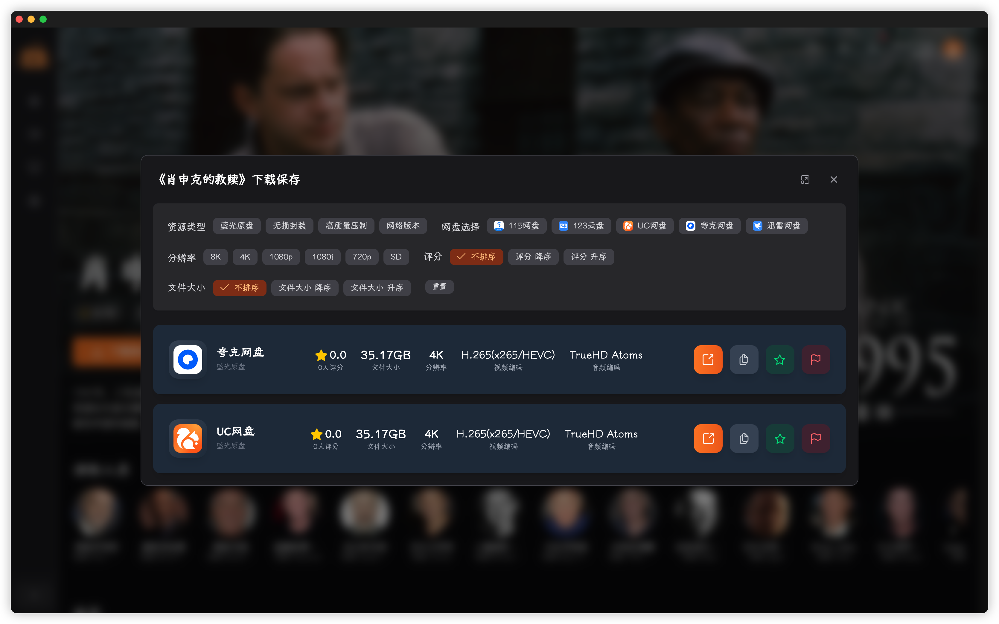

- Movie Resource Sharing:

  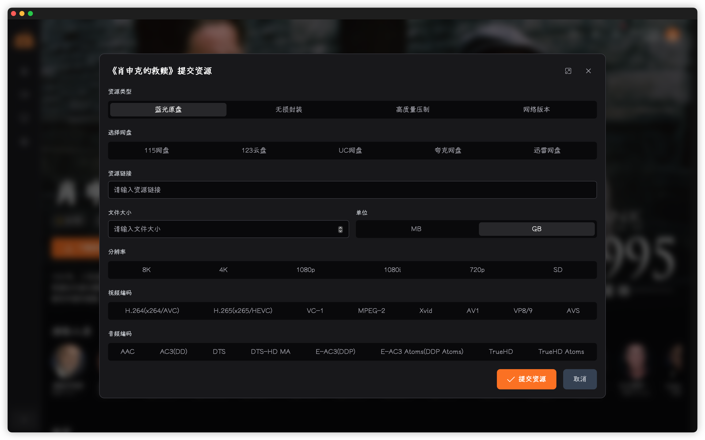

- TV Show Library:

  

- TV Show Details:

  

- TV Show Download:

  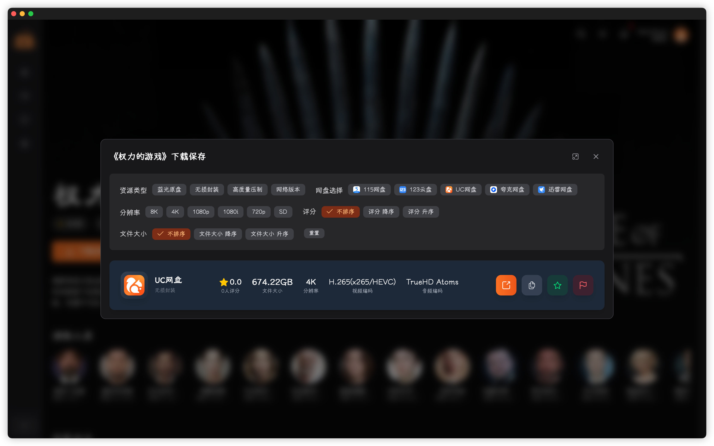

- TV Show Resource Sharing:

  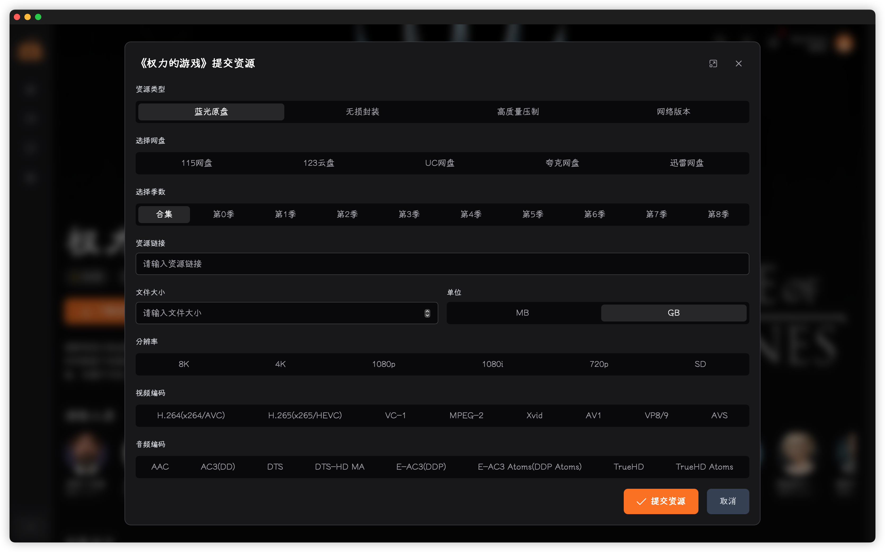

- TV Show Season Details:

  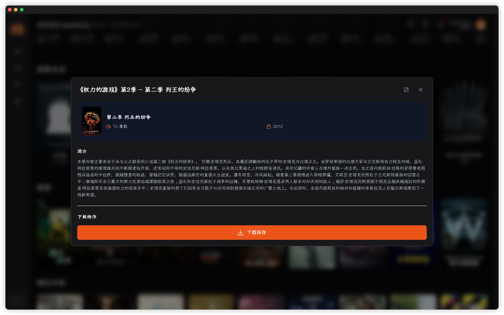

- Cast Details:
  
  

- Search:
  
  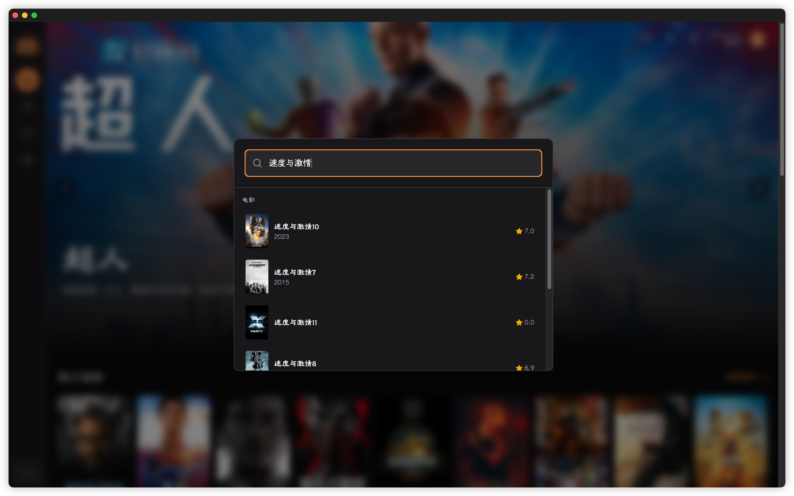

- Theme & Font Settings:
  
  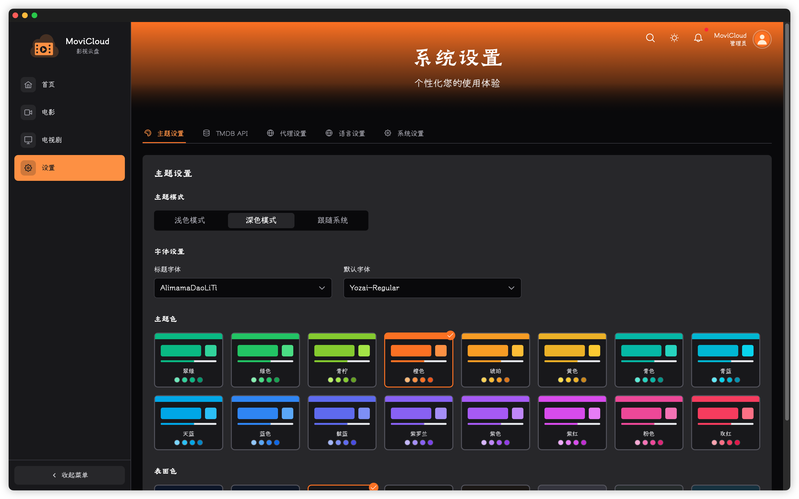

- TMDB Settings:
  
  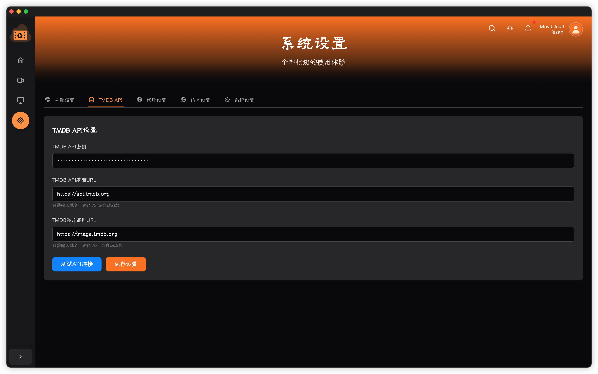

- Language Settings:
  
  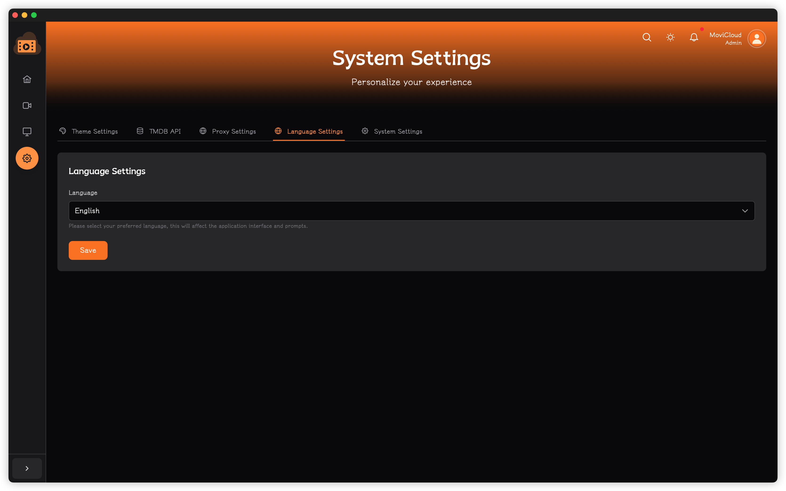

- Profile Settings:
  
  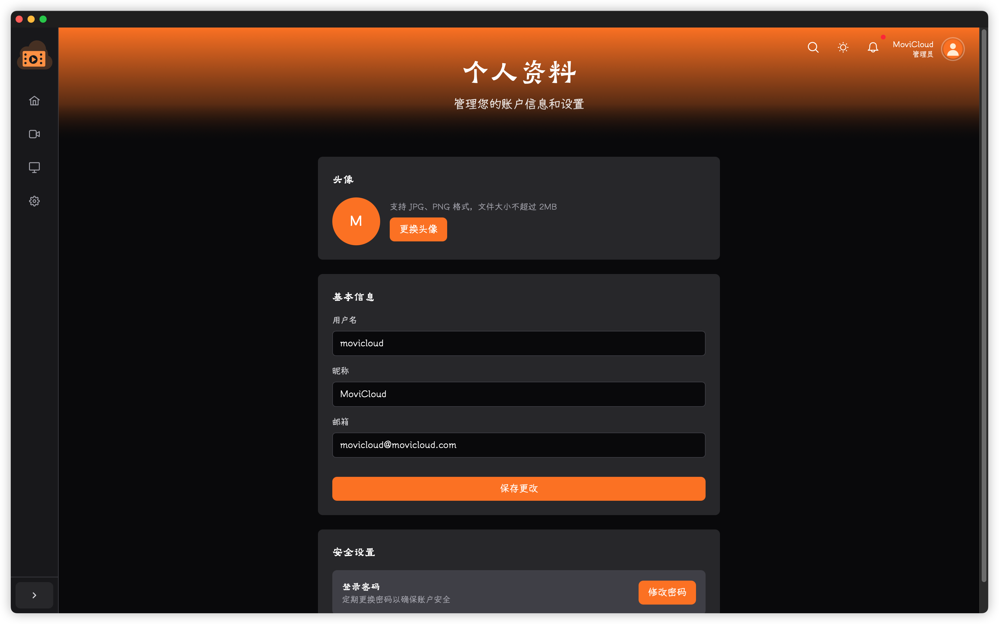
