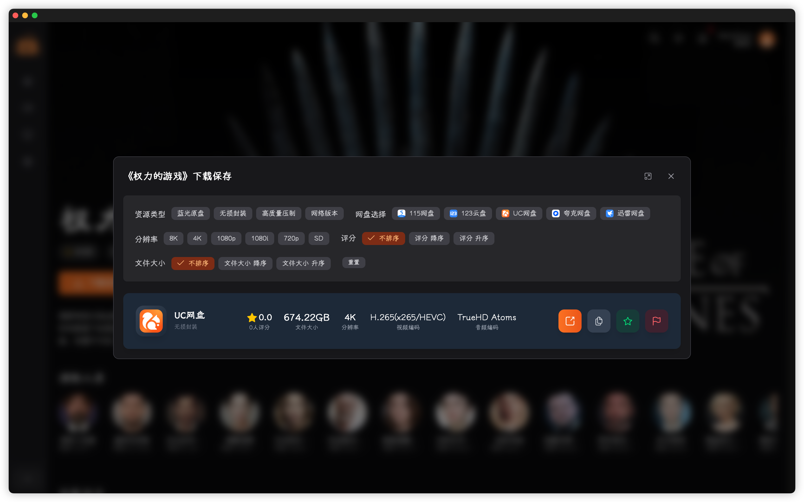
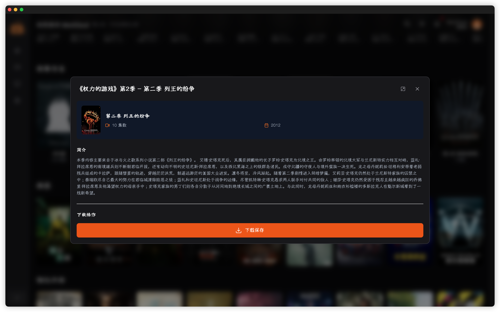
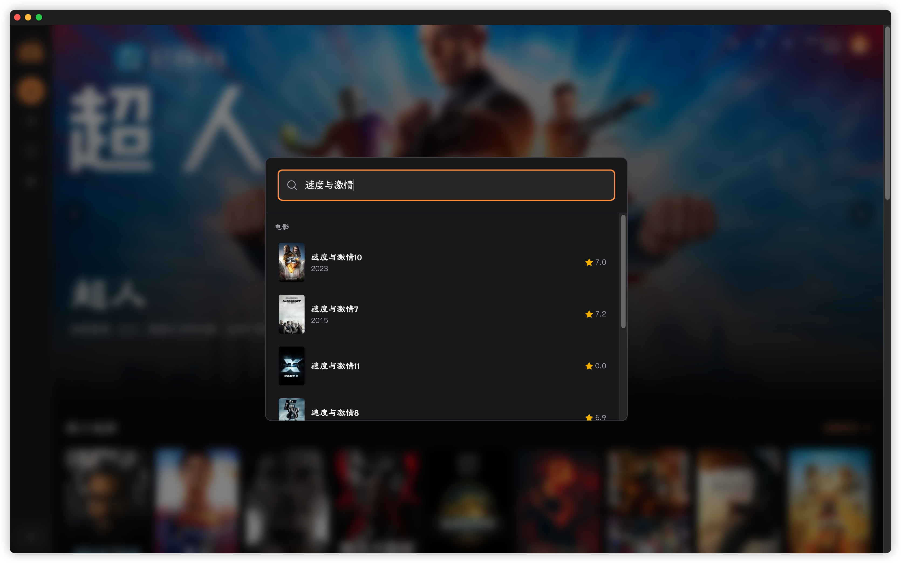
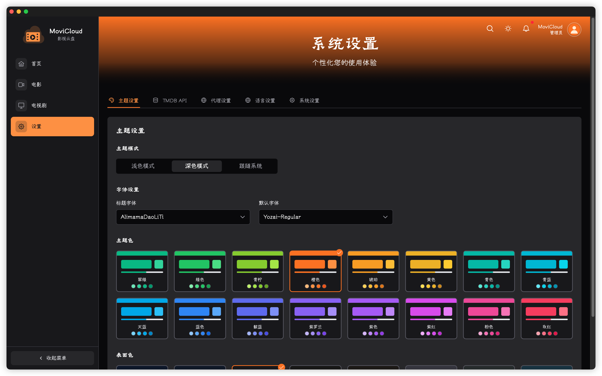
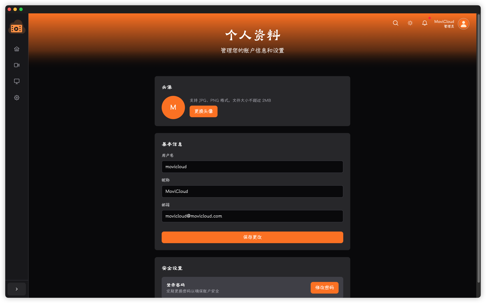

[English](README.md) | [简体中文](README.zh-CN.md)

# MoviCloud 影视云盘（Docker 优先安装指南）

MoviCloud 是一款基于 Nuxt 3 的影视聚合与浏览应用，集成 TMDB 数据，支持电影/剧集信息展示、搜索、个人资料、下载入口等功能。本文档聚焦“如何使用”，尤其是 Docker 安装与持久化。

## 亮点

- 🎬 电影/电视剧详情、演员与片单推荐
- ⚡ 前端图片懒加载与缓存，体验流畅
- 🌙 深色主题与响应式布局
- 🧭 安装向导（首启自动引导配置）
- 🐳 官方 Docker 镜像：`movicloud/movicloud-app`（支持 amd64/arm64）

---

## 一、快速开始（Docker）

### 1) 拉取镜像
```bash
docker pull movicloud/movicloud-app:latest
```

### 2) 一键运行（最简）
```bash
docker run -d \
  --name movicloud \
  -p 15078:15078 \
  -v movi_data:/movicloud-app/data \
  -e NODE_ENV=production \
  movicloud/movicloud-app:latest
```
- 访问地址：`http://<你的IP或域名>:15078`
- 首次进入会自动跳转安装向导（`/install`）
- 数据（数据库、上传头像等）持久化在容器路径：`/movicloud-app/data`

### 3) 推荐：Docker Compose
```yaml
services:
  movicloud:
    image: movicloud/movicloud-app:latest
    container_name: movicloud
    restart: unless-stopped
    ports:
      - "15078:15078"
    environment:
      - NODE_ENV=production
      # 可选：时区与 JWT 密钥
      - TZ=Asia/Shanghai
      - JWT_SECRET=your-strong-secret
      # 可选：网络在受限环境下的代理（仅当需要）
      # - HTTP_PROXY=http://host.docker.internal:7890
      # - HTTPS_PROXY=http://host.docker.internal:7890
      # - NO_PROXY=localhost,127.0.0.1
    volumes:
      - movi_data:/movicloud-app/data
volumes:
  movi_data:
```
启动：
```bash
docker compose up -d
```

---

## 二、首次安装向导

1. 访问 `http://<你的IP或域名>:15078/install`
2. 在向导中完成：
   - TMDB API Key 配置
   - 语言与主题
   - （如需要）网络代理配置
   - 创建管理员账号
3. 完成后即可使用，所有设置支持在“设置”页面修改。

提示：系统会将常用设置缓存到前端。修改设置后，前端缓存会自动刷新。

---

## 三、数据持久化与目录说明

- 应用数据：`/movicloud-app/data`
  - 数据库：`/movicloud-app/data/movicloud.db`
  - 上传头像：`/movicloud-app/data/uploads/avatars`
- 日志目录：`/movicloud-app/logs`（如需挂载，可自定义）
- 生产环境静态访问：`/uploads/avatars/<文件名>`
  - 示例：`http://<你的域名>/uploads/avatars/avatar_1690000000000.png`

使用命名卷或绑定宿主机目录均可，例如：
```bash
docker run -d \
  --name movicloud \
  -p 15078:15078 \
  -v /your/host/path/data:/movicloud-app/data \
  movicloud/movicloud-app:latest
```

> 若使用宿主目录，请确保宿主目录对容器内运行用户（默认 `node`）可写。

---

## 四、升级与回滚

- 升级至最新：
```bash
docker pull movicloud/movicloud-app:latest
# 若使用 run 方式：先停止并删除旧容器，再以相同卷参数启动
docker stop movicloud && docker rm movicloud
# 重新运行（保持同样的 -v 卷映射）
```
- Docker Compose：
```bash
docker compose pull
docker compose up -d
```
- 回滚到某版本：
```bash
docker run -d ... movicloud/movicloud-app:1.0.1
```

镜像标签策略（示例）：`latest`、语义化版本（如 `1.0.1`、`1.0`）。

---

## 五、常见问题（FAQ）

- 问：访问不到页面？
  - 检查端口映射是否为 `-p 15078:15078`
  - 若有反向代理，确认转发到容器端口 `15078`

- 问：在 Docker 中头像不保存或访问不到？
  - 确认已挂载 `data` 卷：`/movicloud-app/data`
  - 访问路径应形如：`/uploads/avatars/<文件名>`
  - 若使用宿主目录，确保写权限（推荐使用命名卷）

- 问：网络受限地区图片或 TMDB 访问慢？
  - 在安装向导或“设置”中配置代理；或在容器环境变量中设置 `HTTP_PROXY/HTTPS_PROXY`
  - 应用会缓存 TMDB 图片域名设置，修改设置后前端会刷新缓存

- 问：如何健康检查？
  - 健康检查接口：`/api/health`（返回 200 表示正常）

- 问：如何自定义安全与时区？
  - 设置环境变量 `JWT_SECRET` 与 `TZ`

---

## 六、反向代理（可选）

以 Nginx 为例：
```nginx
server {
  listen 80;
  server_name your.domain.com;

  location / {
    proxy_pass http://127.0.0.1:15078;
    proxy_set_header Host $host;
    proxy_set_header X-Real-IP $remote_addr;
    proxy_set_header X-Forwarded-For $proxy_add_x_forwarded_for;
    proxy_set_header X-Forwarded-Proto $scheme;
  }

  # 上传文件静态访问（可选，应用已内置处理 /uploads/ 路由）
  location /uploads/ {
    proxy_pass http://127.0.0.1:15078;
  }
}
```

---

## 七、页面截图

- 安装欢迎：

  

- 安装TMDB设置：

  

- 安装用户设置：

  

- 安装确认：

  

- 安装成功：

  

- 用户登录：

  

- 首页轮播与推荐：
  
  

- 电影库：

  

- 电影详情页：

  

- 电影下载窗口：

  

- 电影资源分享窗口：

  

- 电视剧库：

  

- 电视剧详情页：

  

- 电视剧下载窗口：

  

- 电视剧资源分享窗口：

  

- 电视剧剧情详情窗口：

  

- 演职人员详情：
  
  

- 搜索窗口：
  
  

- 主题和字体设置：
  
  

- TMDB设置：
  
  

- 系统代理设置：
  
  

- 系统语言设置：
  
  

- 个人设置：
  
  
